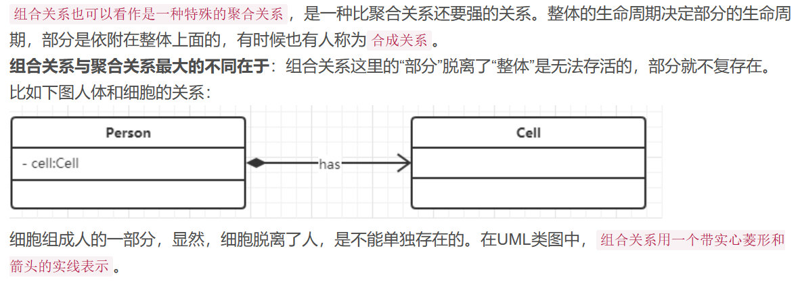
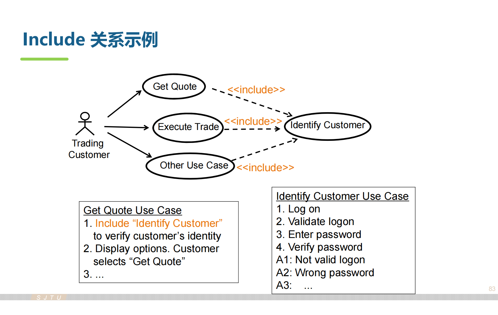
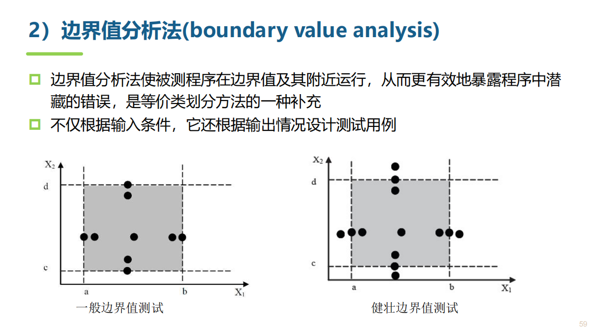
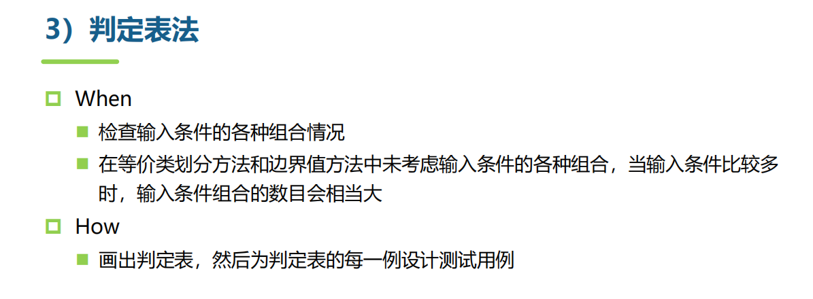

# 软件工程原理与实践

by [PeterTheSparrow](https://github.com/PeterTheSparrow)

本文档整理上海交通大学软件学院《软件工程原理与实践》课程的相关知识点，用于期末考试复习。
本文档仅供学习使用；如若侵犯任何个人或者集体的利益，请联系删除。

<!-- TOC -->

- [软件工程原理与实践](#软件工程原理与实践)
  - [chapter 0. 课程大纲](#chapter-0-课程大纲)
  - [chapter 1. 往年期末试卷知识点选讲](#chapter-1-往年期末试卷知识点选讲)
    - [\> 1.1 类图](#-11-类图)
      - [\> 1.1.1  类](#-111--类)
      - [\>1.1.2  类和类的关系](#112--类和类的关系)
        - [\>1.1.2.1 泛化（Generalization）/ 继承（Inheritance）](#1121-泛化generalization-继承inheritance)
        - [\>1.1.2.2 关联关系（Association）](#1122-关联关系association)
        - [\>1.1.2.3 聚合（Aggregation）](#1123-聚合aggregation)
        - [\>1.1.2.4 组合（Composition）](#1124-组合composition)
        - [\>1.1.2.5 依赖（Dependency）](#1125-依赖dependency)
    - [\>1.2 时序图](#12-时序图)
    - [\>1.3 状态图](#13-状态图)
    - [\>1.4 用例图（use case）](#14-用例图use-case)
      - [\>1.4.1 用例图概述](#141-用例图概述)
      - [\>1.4.2 识别actor和use case，画use-case图](#142-识别actor和use-case画use-case图)
      - [\>1.4.3 编写use-case spec.](#143-编写use-case-spec)
      - [\>1.4.4 优化use-case图的结构](#144-优化use-case图的结构)
    - [\>1.5 黑盒白盒测试](#15-黑盒白盒测试)
      - [\>1.6.1 白盒测试](#161-白盒测试)
      - [\>1.6.2 黑盒测试](#162-黑盒测试)
    - [\>1.6 项目设计的软件过程](#16-项目设计的软件过程)
  - [chapter 2. 上课练习题以及考试题选](#chapter-2-上课练习题以及考试题选)
    - [\>2.1 考前习题课内容](#21-考前习题课内容)
      - [\>2.1.1 黑盒测试1](#211-黑盒测试1)
      - [\>2.1.2 黑盒测试2](#212-黑盒测试2)
      - [\>2.1.3 概念题](#213-概念题)
      - [\>2.1.4 软件设计过程](#214-软件设计过程)
      - [\>2.1.5 用例建模](#215-用例建模)
      - [\>2.1.6 状态图](#216-状态图)
      - [\>2.1.7 设计模式](#217-设计模式)

<!-- /TOC -->

## chapter 0. 课程大纲

1. 引论
2. 软件过程
3. 软件工程模型和方法
4. **软件需求【重点】**
5. 软件架构设计
6. 软件详细设计
7. 用户界面设计
8. 编码、版本管理
9. 软件测试
10. 软件运维
11. 软件项目管理


## chapter 1. 往年期末试卷知识点选讲

### > 1.1 类图

课本P120

以下内容很多摘自[这篇文章](https://blog.csdn.net/smilehappiness/article/details/105527488)

**概述**
类图：
- 类
- 类和类的关系

#### > 1.1.1  类


属性或者方法名称前加的加号和减号是什么意思呢？它们表示了这个属性或方法的可见性，UML类图中表示可见性的符号有三种：

`+`：表示public
`-`：表示private
`#`：表示protected（friendly也归入这类）

#### >1.1.2  类和类的关系


##### >1.1.2.1 泛化（Generalization）/ 继承（Inheritance）


##### >1.1.2.2 关联关系（Association）

关联关系中包括两种特殊的关联关系：
聚合（Aggregation）和组合（Composition）


##### >1.1.2.3 聚合（Aggregation）


##### >1.1.2.4 组合（Composition）



##### >1.1.2.5 依赖（Dependency）


### >1.2 时序图

课本P124

### >1.3 状态图

略

### >1.4 用例图（use case）

**参考资料**
- 课本P128
- 链接[1](https://blog.csdn.net/cold___play/article/details/100824261)

#### >1.4.1 用例图概述


#### >1.4.2 识别actor和use case，画use-case图


- Actor：参与者，可以是人，也可以是其他系统。例如：学生选课，学生就是Actor；我选课系统和jacount进行交互，甲亢就是Actor。
- Use Case：用例。学生选课，选课这件事情就是use case。


- 上面一张图的第三条，传感器（Actor）要告诉系统窗户是不是开着的；所以窗户开关信息告知就是一个use case。
- 第四条，警报器（actor）需要系统告诉他火灾是否发生了，所以火灾信息告知就是一个use case。


- 不能太小，比如增删改查，可以统一成为“信息管理”。
- use case**取名一定是一个动宾结构**，使得容易理解。


- 画箭头，谁发起的通信

上面这些都掌握以后，我们来看：
- 总的一个例子：


#### >1.4.3 编写use-case spec.

Use Case Specification（用例规约）是一种软件需求规格说明书，它包含了一个或多个用例的详细描述、输入和输出条件、前置条件和后置条件等信息。简单来说，Use Case Specification定义了系统中一个或多个用例的执行过程和预期结果。

在Use Case Specification中，每个用例都被视为一个完整的系统功能，由以下几个部分组成：

- 标题和简述：对用例的简要描述；
- 用例ID：用于唯一标识该用例的编号；
- 参与者（Actors）：用例涉及的角色或者人员；
- 前置条件（Pre-conditions）：执行该用例需要满足的条件；
- 关键流程（Main Flow）：用例中的主要步骤，以及输入和输出条件；
- 扩展流程（Alternative Flows）：当关键流程无法执行时，用例所执行的其他步骤；
- 后置条件（Post-conditions）：用例执行后所达到的状态。

通过Use Case Specification，可以帮助开发人员更好地理解系统中各个用例的执行过程和预期结果，同时也可以帮助用户或者测试人员更好地了解系统的功能和使用方法。

总之，Use Case Specification是一种重要的软件需求规格说明书，能够帮助开发团队和用户更好地理解系统中各个用例的执行过程和预期结果，从而提高软件开发的效率和质量。


- 最重要的还是**简要描述+事件流**


- 基本流：比如选课成功；
- 备选流：选课，这门课被抢完了（偶尔发生的情况，概率很小）；系统崩了……

**新的概念：Scenario 场景**
Scenario是user-case的实例


#### >1.4.4 优化use-case图的结构

优化的时候，实际上就是新增了：
- actor和actor之间的关系
- use case和use case之间的关系
（因为我们之前研究的都是actor和use case之间的关系）




这张扭得和方便面一样的图是什么意思呢：
- 执行base case的时候，会执行include的use case（执行完了再回来）


- 例如：炒股软件中，看报价单，可能会去看一下新闻；又可能看看专家的预测。**include是一定去做，extend是可能去做**。


### >1.5 黑盒白盒测试

黑盒测试和白盒测试是软件测试中两种不同的方法。

**黑盒测试**是一种测试方法，其中测试者不需要了解被测试系统的内部工作原理。测试者只需以用户的角度进行测试，并检查系统是否按照规格说明或其他要求正确运行。因此，黑盒测试通常被认为是从外部对系统进行测试的一种方法。

**白盒测试**是另一种测试方法，在此测试者需要具有对被测试系统的内部结构和代码的了解。测试者可以查看源代码并进行调试，以确保系统的每个部分都按照预期方式运行。因此，白盒测试通常被认为是从内部对系统进行测试的一种方法。

总之，黑盒测试更侧重于检查系统的功能是否满足用户需求，而白盒测试更侧重于检查系统是否按照设计实现，并识别潜在的编程错误和逻辑错误。根据测试的目的和要求，测试人员可以选择使用黑盒测试、白盒测试或两种测试方法的组合。

#### >1.6.1 白盒测试

下面内容来自沈备军老师授课ppt。


#### >1.6.2 黑盒测试

下面内容来自沈备军老师授课ppt。






> **课堂练习**
> 请针对以下软件采用黑盒测试方法设计测试用例：
从键盘上输入三个整数（最大值为255），这三个数值表示三角形三条边的长度。然后，输出信息，以表明这个三角形是等腰、等边或是一般三角形，或不能构成三角形。

```bash
按照输入划分等价类
1、有效等价类：输入三个1-255的整数
2、无效等价类：
（1）输入的整数小于1
（2）输入的整数大于255
（3）输入的数字不是整数
（4）输入了非数字的字符


黑盒测试用例设计：

1、 输入三个相等的整数（50，50，50），预期输出等边三角形
2、 输入三个相等的整数（-1，-1，-1），预期输出不能构成三角形
3、 输入三个相等的整数（256，256，256），预期输出不能构成三角形
4、 输入三个整数（其中两个相等），（2，2，25），预期输出不能构成三角形
5、 输入三个整数（其中两个相等），（25，25，24），预期输出等腰三角形
6、 输入三个整数（其中两个相等），（257，257，256），预期输出不能构成三角形
7、 输入三个整数（其中两个相等），（-1，-1，2），预期输出不能构成三角形
8、 输入三个互不相等的整数，（6，7，8），预期输出一般三角形
9、 输入三个互不相等的整数，（255，256，257），预期输出不能构成三角形
10、输入(a,b,123），预期输出不能构成三角形
11、输入（12.67，12，2），预期输出不能构成三角形

边界检查：
12、输入（255，255，255），预期输出等边三角形
13、输入（1，1，1），预期输出等边三角形
14、输入（0，0，0），预期输出不能构成三角形
15、输入（255，255，254），预期输出等腰三角形
```


### >1.6 项目设计的软件过程

## chapter 2. 上课练习题以及考试题选

### >2.1 考前习题课内容

#### >2.1.1 黑盒测试1


事件流覆盖（Event Flow Coverage）是一种基于黑盒测试的测试方法，用于检查系统在不同输入条件下的行为是否符合预期。它通过描述各种可能的输入事件及其相应的响应事件之间的关系，来确定测试用例的设计和执行。

在事件流覆盖测试中，测试用例通常被设计为**一系列输入事件**，这些事件按照特定的顺序触发，并且每个事件都有一个或多个预期输出。测试人员需要根据事件之间的关系设计测试用例，以确保所有可能的事件序列都得到了覆盖。

具体来说，使用事件流覆盖测试时，测试人员通常需要执行以下步骤：

1. 根据需求分析和设计文档，确定所有可能的输入事件以及它们对应的输出事件；
2. 根据输入事件之间的关系，设计并执行测试用例，确保所有可能的事件组合都得到了覆盖；
3. 记录测试结果，并根据测试结果对系统进行改进。

通过事件流覆盖测试，可以有效地检查系统在不同场景下的行为是否符合预期，从而降低系统出错的风险。同时，它也能够提供对系统中潜在问题的深入理解，从而帮助开发人员提高代码质量和系统可靠性。

总之，事件流覆盖是一种基于黑盒测试的测试方法，能够帮助测试人员发现系统中潜在的问题，并提高测试的覆盖率和质量。

```
question：需要几个测试用例？

覆盖所有事件流——一共两个事件流（基本流一个，备选流一个；基本流里面有六个步骤，备选流里面有两个步骤）。总共需要两个测试用例。
```

#### >2.1.2 黑盒测试2


这里的关键是条件判断（条件组合）：
1. 是不是年薪制员工？
2. 有没有严重过失？
3. 有没有过失？

总而言之，输入如果有条件组合，就要用判定表来覆盖所有情况。


#### >2.1.3 概念题


#### >2.1.4 软件设计过程


进度风险如何解决？（不能外包）
1. 复用前人的ui代码，复用开源代码
2. 采用增量式递交——前三个功能或者前四个功能先做，在十月一日先递交，余下的功能在十月三十一日递交。

- 每个迭代都对某个风险进行缓解


**--------以下为期中考试之前的部分--------**
**面向对象分析与设计习题课**

用uml分析，包括三个点：
1. 建立用例模型（用例图）
2. 建立概念模型（类图）
3. 建立分析模型

#### >2.1.5 用例建模


答案：B

extend是有的时候做，有的时候不做，显然是不对的。
而且在这个系统中，最重要的、最有价值的部分是购物和修改会员资料，因此这俩应该是base case，选择B。

**【用例是能卖的价值】**


对还是不对？好还是不好？

actor肯定是对的。
问题在于粒度太细了，增删改查经常是一起做的。经常一起做的事情放在一起。include常常是几个use-case的共性拿出来，千万别做功能分解。


哪种方案更好？

还是考粒度的问题，人事部的人其实也是员工（（（

最好的还是C。因为这三件事情不是一起做的。因为这三件事情不是同步的，因此分三件事情。


因为这仨人想法不一样，因此界面要做不一样的……


1. 问诊extend开处方
2. dbms就是你要做的系统，不是actor（不算外部系统）
3. 问诊要写清楚，“记录问诊信息”


减钱的粒度太小了。这只是一个比较小的步骤而已。

#### >2.1.6 状态图


#### >2.1.7 设计模式

创建型设计模式（Creational Design Patterns）和结构型设计模式（Structural Design Patterns）都是面向对象编程中常用的设计模式。

**创建型设计模式** 用于处理对象的创建机制，包含以下几种模式：

1. 工厂方法模式（Factory Method Pattern）：定义一个用于创建对象的接口，让子类决定实例化哪个类。
2. 抽象工厂模式（Abstract Factory Pattern）：提供一个接口，用于创建相关或依赖对象的家族，而不需要明确指定它们的具体类。
3. 建造者模式（Builder Pattern）：将一个复杂对象的构建与它的表示分离，使得同样的构建过程可以创建不同的表示。
4. 单例模式（Singleton Pattern）：确保一个类只有一个实例，并提供对该实例的全局访问点。
5. 原型模式（Prototype Pattern）：用原型实例指定创建对象的种类，并且通过克隆这些原型来创建新的对象。

**结构型设计模式** 用于处理类或对象间的组合关系，包含以下几种模式：

1. 适配器模式（Adapter Pattern）：将一个类的接口转换成客户端希望的另一个接口，使得原本由于接口不兼容而不能在一起工作的那些类能够在一起工作。
2. 桥接模式（Bridge Pattern）：将抽象部分与它的实现部分分离，使它们都可以独立地变化。
3. 组合模式（Composite Pattern）：将对象组合成树形结构以表示“部分-整体”的层次结构，使得客户端对单个对象和组合对象的使用具有一致性。
4. 装饰器模式（Decorator Pattern）：动态地给一个对象添加一些额外的职责，即增加其功能。
5. 外观模式（Facade Pattern）：为子系统中的一组接口提供一个统一的接口，用来访问子系统中的各种功能。
6. 享元模式（Flyweight Pattern）：运用共享技术来有效地支持大量细粒度对象的复用。

总之，创建型设计模式和结构型设计模式是面向对象编程中常用的两种设计模式。前者主要用于处理对象的创建机制，后者主要用于处理类或对象间的组合关系。选择适当的设计模式可以提高代码的可读性、可维护性和可扩展性。